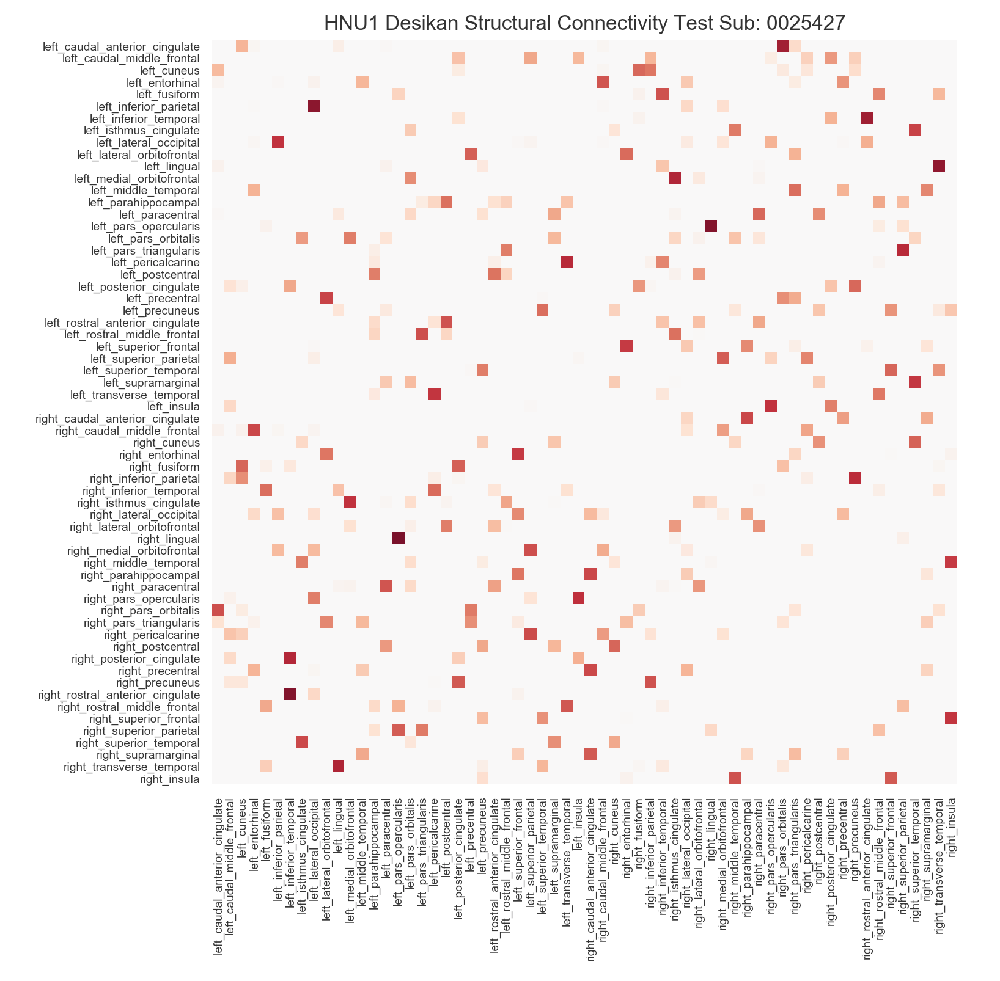
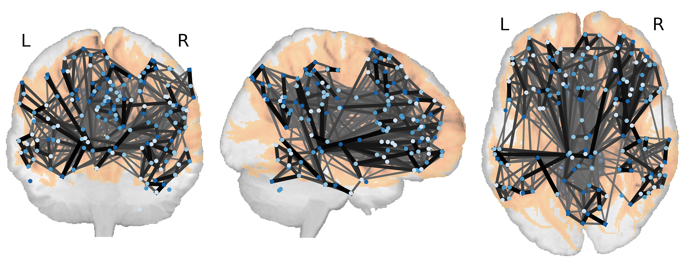
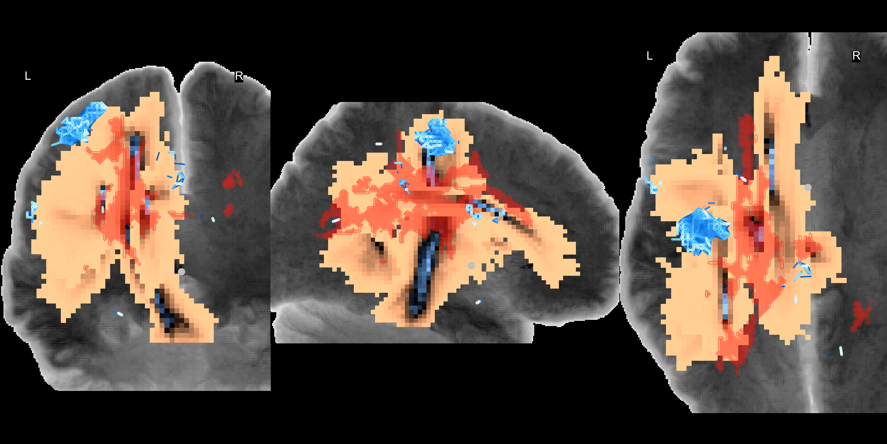

PyNets
======

About
-----
A Python-Powered Workflow for Fully-Reproducible Network Analysis of Resting-State fMRI (rsfMRI) and Diffusion MRI (dMRI)

Problem: A comprehensive, flexible, and fully-automated intra-subject network analysis package for neuroimaging has yet to be implemented.

Solution: In PyNets, we harness the power of Nipype, Nilearn, and Networkx python packages to automatically generate a variety of meta-connectomic solutions on a subject-by-subject basis, using any combination of network construction parameters. PyNets utilities can be integrated with any existing preprocessing workflow for your data and provides a docker container to uniquely facilitate complete reproducibility of executions.

Learn more about Nipype: http://nipype.readthedocs.io/
Learn more about Nilearn http://nilearn.github.io/
Learn more about Networkx: https://networkx.github.io/

-----

Walkthrough of the pipeline:

Required User Inputs:

    -Subject's data- Any 4D preprocessed fMRI file or diffusion weighted image file with completed bedpostx outputs, or both
    -A subject ID (ideally the same name as the directory containing the input data)
    -Any one or multiple atlases by name from the nilearn 'fetch' collection, one or multiple atlas files, one or multiple individual parcellation files generated at various resolutions of k using PyClusterROI routines and masks, a group parcellation file generated using Bootstrap Analysis of Stable Clusters (BASC) for subject-level parcellation (in construction).
    -Graph or subgraph specification: Whole-brain, restricted networks with affinity to custom masks, Yeo 7 and 17 resting-state networks)
    -Graph model estimation type (e.g. covariance, precision, correlation, partial correlation)
    -Choice of atlas labels as nodes or spheres (of any radius or multiple radii) as nodes

Features of the PyNets Pipeline:

-Grows nodes based on any parcellation scheme (nilearn-defined or user-defined with an atlas file) and node style (spheres of a given radius, several radii, or parcels), and then extract the subject's time series from those nodes. Alternatively, use spectral clustering to generate and use a functional parcellation for any value of k or iteratively across several values of k.

-Model a functional connectivity matrix for the rsfMRI data (based on a wide variety of correlation and covariance family of estimators)

-Threshold the graphs using either of proportional thresholding, target-density thresholding, or multi-thresholding (i.e. iterative pynets runs over a range of proportional or density thresholds).

-Optionally model a probabilistic structural connectivity matrix using dMRI bedpostx outputs.

-Optionally generate connectome glass brain plots, adjacency matrices, D3 visualizations, and gephi-compatible .graphml files

-Extract network statistics for the graphs:\
global efficiency, local efficiency, transitivity, degree assortativity coefficient, average clustering coefficient, average shortest path length, betweenness centrality, eigenvector centrality, degree pearson correlation coefficient, number of cliques, smallworldness, rich club coefficient, communicability centrality, and louvain modularity.

-Aggregate data across multiple simulations for a single subject.

-Aggregate data into a group database

-Reduces dimensionality of nodal metrics at the group level using cluster analysis, PCA, and/or multi-threshold averaging (IN CONSTRUCTION)

-----

1. Installation
PyNets is now available for python3 in addition to python2.7! We recommend using python3.
```python
##Clone the PyNets repo and install dependencies
git clone https://github.com/dpisner453/PyNets.git
cd /path/to/PyNets
python setup.py install

#Or within the PyNets parent directory:
pip install -e .

#Or install from PyPi (recommended)
pip install pynets
```

To install using the included dockerfile, ensure you have installed Docker (https://www.docker.com/) and then run:
```
BUILDIR=$(pwd)
mkdir -p ${BUILDIR}/pynets_images
docker build -t pynets_docker .

docker run -ti --rm --privileged \
    -v /tmp:/tmp \
    -v /var/tmp:/var/tmp \
    pynets_docker
``` 

2. Usage:

See pynets_run.py -h for help options.

Examples:
Situation A) You have a fully preprocessed (normalized and skull stripped!) functional rsfMRI image called "filtered_func_data_clean_standard.nii.gz" where the subject id=997, you wish to extract network metrics for a whole-brain network, using the nilearn atlas 'coords_dosenbach_2010', you wish to threshold the connectivity graph by preserving 95% of the strongest weights (also the default), and you wish to use basic correlation model estimation:
```python
pynets_run.py '/Users/dpisner453/PyNets_examples/997/filtered_func_data_clean_standard.nii.gz' -id '997' -a 'coords_dosenbach_2010' -mod 'corr' -thr '0.95'
```
&nbsp;&nbsp;&nbsp;&nbsp;&nbsp; Situation B) You have a fully preprocessed (normalized and skull stripped!) functional rsfMRI image  called "filtered_func_data_clean_standard.nii.gz" where the subject id=997, you wish to extract network metrics for the Default network, using the 264-node atlas parcellation scheme from Power et al. 2011 called 'coords_power_2011', you wish to threshold the connectivity graph iteratively to achieve a target density of 0.3, you define your node radius as 4 voxels in size (2 is the default), you wish to fit model with sparse inverse covariance, and you wish to plot the results:
```python
pynets_run.py -i '/Users/dpisner453/PyNets_examples/997/filtered_func_data_clean_standard.nii.gz' -id '997' -a 'coords_power_2011' -n 'Default' -dt -thr '0.3' -ns '4' -mod 'sps' -plt
```

&nbsp;&nbsp;&nbsp;&nbsp;&nbsp; Situation C) You have a fully preprocessed (normalized and skull stripped!) functional rsfMRI image  called "filtered_func_data_clean_standard.nii.gz" where the subject id=997, you wish to extract network metrics for the Executive Control Network, using an atlas file called DesikanKlein2012.nii.gz, you define your node radius as both 2 and 4 voxels in size, and you wish to fit model with partial correlation, and you wish to iterate the pipeline over a range of proportional thresholds (i.e. 0.90-0.99 with 1% step):
```python
pynets_run.py -i '/Users/dpisner453/PyNets_examples/997/filtered_func_data_clean_standard.nii.gz' -id '997' -ua '/Users/dpisner453/PyNets_example_atlases/DesikanKlein2012.nii.gz' -n 'Cont' -ns '2,4' -mod 'partcorr' -min_thr 0.90 -max_thr 0.99 -step_thr 0.01
```

3. Viewing outputs:\
&nbsp;&nbsp;&nbsp;&nbsp;&nbsp; PyNets outputs network metrics into text files and pickled pandas dataframes within the same subject folder
in which the initial image or time-series was fed into the workflow. To open the pickled pandas dataframes
from within the interpreter, you can:
```python
import pandas as pd
##Assign pickle path for the covariance (as opposed to the sparse inverse covariance net)
pickle_path = '/Users/dpisner453/PyNets_examples/200/200_net_global_scalars_cov_200'
df = pd.read_pickle(pickle_path)
df
```

&nbsp;&nbsp;&nbsp;&nbsp;&nbsp; These dataframes can then be iteratively loaded and aggregated by row into a single dataframe across subjects, where there is 1 row per subject. Here is an example of what that code could look like (where 'frame' here is the aggregated df):
```python
import glob
import os
import pandas as pd
###
working_path = r'/work/04171/dpisner/data/ABM/network_analysis/' # use your path
name_of_network_pickle = 'net_metrics_sps_Default_mean'
###

allFiles = []
for ID in os.listdir(working_path):
    path_name = working_path + ID + '/' + ID + '_' + name_of_network_pickle
    if os.path.isfile(path_name):
        print(path_name)
        allFiles.append(path_name)

frame = pd.DataFrame()
list_ = []

for file_ in allFiles:
    df = pd.read_pickle(file_)
    node_cols = [s for s in list(df.columns) if isinstance(s, int) or any(c.isdigit() for c in s)]
    list_.append(df)

frame = pd.concat(list_)

out_path = working_path + '/' + name_of_network_pickle + '_output.csv'
frame.to_csv(out_path)
```
Generate a glass brain plot for a functional or structural connectome

Visualize adjacency matrices for structural or functional connectomes

Feed the path to your bedpostx directory into the pipeline to get a structural connectome

Visualize communities of networks

Use connectograms to visualize community structure (including link communities)


Happy Netting!

Please cite ALL uses with reference to the github website at: https://github.com/dpisner453/PyNets
